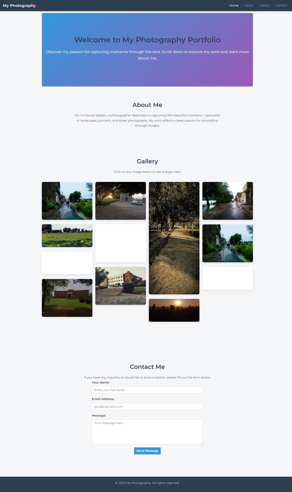

# My Photography Portfolio

A responsive photography portfolio website built using HTML, CSS, and Bootstrap.

## Overview

This project is a responsive photography portfolio designed to showcase photography work. It features a gallery section with modal popups for larger image views, smooth scrolling navigation, a contact form for inquiries, and an option to add new images dynamically.

## Features

- **Responsive Design:** Adapts to various screen sizes using Bootstrap.
- **Smooth Navigation:** Fixed navbar with smooth scrolling.
- **Interactive Gallery:** Clickable images open in modal dialogs for a larger view.
- **Add Image Option:** Easily add new images to the gallery using a simple interface.
- **Custom Styling:** Tailored styles using CSS and Google Fonts.
- **Contact Form:** Visitors can send inquiries directly from the site.

## Add Image Option

The "Add Image" feature allows you to upload new images and have them automatically displayed in the gallery. The implementation includes:

- **Upload Button:** An interface element to select and upload images.
- **Preview Modal:** A modal popup that shows the uploaded image before confirmation.
- **Dynamic Gallery Update:** Once an image is added, the gallery is refreshed to include the new photo.

*Example Workflow:*  
1. Click the **Add Image** button.  
2. Select an image from your computer.  
3. A preview of the image is displayed for confirmation.  
4. Confirm the upload to see the image added to your gallery.

## Screenshot

Below is a screenshot of the webpage output:

*Note:* Replace `image.png` with the actual screenshot file if the filename is different.

## File Structure

- **Photo Gallery.html:** Main HTML file that structures the portfolio and includes the add image functionality.
- **style.css:** Contains all custom CSS styling for the website.
- **camera-icon.webp:** Favicon used in the project.
- **Other Assets:** Additional images (e.g., gallery photos) and external libraries loaded via CDNs.

## Getting Started

1. **Clone the Repository:**  
   Clone or download the project to your local machine.

2. **Open the Project:**  
   Open `Photo Gallery.html` in your web browser to view the portfolio and test the add image option.

3. **Customization:**  
   Update the HTML, CSS, and image files as needed to personalize your portfolio and the image upload functionality.

## Technologies Used

- **HTML5:** Markup for structuring the webpage.
- **CSS3:** Styling for visual design.
- **Bootstrap 4:** Responsive layout and components.
- **JavaScript (optional):** For handling the dynamic image upload and gallery update.
- **Google Fonts:** Custom typography.

## License

This project is licensed under the MIT License.
